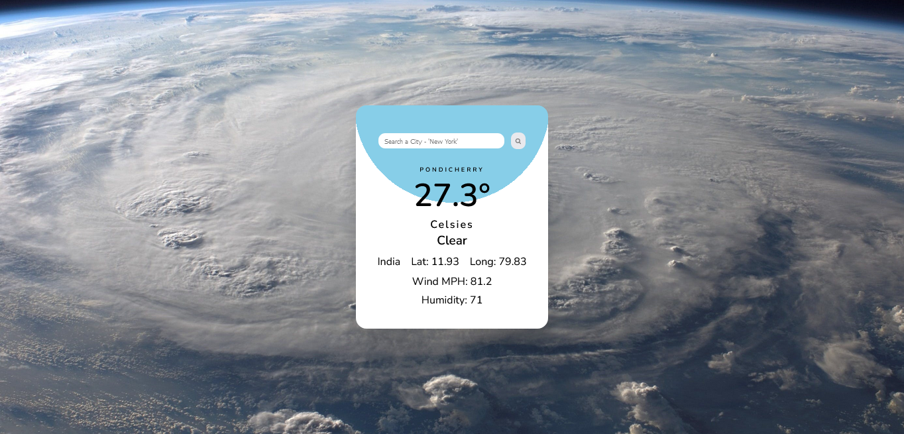

# Weather-App-using-API 
This My 3rd API project i build a Weather app that shows weather report of the city you searched

## **Built With**

-    
-  

## **Outcome**

* Used HTML5 **semantic elements** for better accessability and readability
* Practiced **mobile first workflow** which ensures responsive layout
* Used **Git** and **GitHub** for project management
* Tried to maintain **clean code**
* **Cross tested** on Firefox and Chromium based browsers

 
